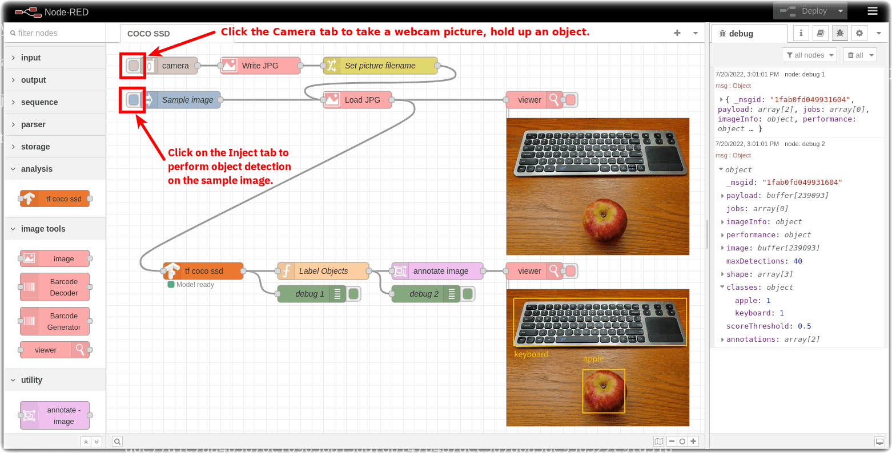
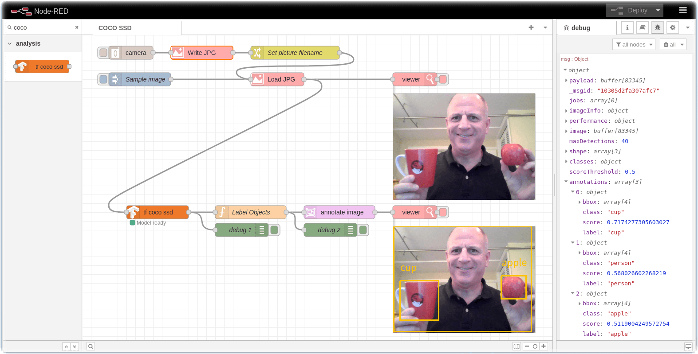

# service-node-red-object-detection

Open Horizon service container demonstrating Node-RED Object Detection.

This is an Open Horizon configuration to deploy an instance of the open-source [Node-RED](https://nodered.org) project. The Node-RED flow is designed to run in a web browser, so you will need to navigate to <http://localhost:1880/> to use the software once it has been deployed.

The Node-RED flow demonstrates Object Detection using the [node-red-contrib-tfjs-coco-ssd](https://flows.nodered.org/node/node-red-contrib-tfjs-coco-ssd) node.  There is a sample image of an Apple and a Keyboard.  If you have a webcam attached to your computer, you can take pictures of objects and detect objects defined in the [coco-ssd model and dataset](https://github.com/tensorflow/tfjs-models/tree/master/coco-ssd)

The identified objects are annotated with bounding boxes using the [node-red-node-annotate-image](https://flows.nodered.org/node/node-red-node-annotate-image) node.



## Prerequisites

**Tensorflow.js**: The Tensorflow.js library will be installed into the container. Tensorflow.js is only available on certain OS/Hardware/processor combinations.

**Management Hub**: [Install the Open Horizon Management Hub](https://open-horizon.github.io/quick-start) or have access to an existing hub in order to publish this service and register your edge node.  You may also choose to use a downstream commercial distribution based on Open Horizon, such as IBM's Edge Application Manager.  If you'd like to use the Open Horizon community hub, you may [apply for a temporary account](https://wiki.lfedge.org/display/LE/Open+Horizon+Management+Hub+Developer+Instance) and have credentials sent to you.

**Edge Node**: You will need an x86 computer running Linux or macOS, or a Raspberry Pi computer (arm64) running Raspberry Pi OS, Ubuntu or Fedora to install and use Node-RED deployed by Open Horizon.  You will need to install the Open Horizon agent software, anax, on the edge node and register it with a hub.

**Optional utilities to install:**  With `brew` on macOS (you may need to install _that_ as well), `apt-get` on Ubuntu or Raspberry Pi OS, `yum` on Fedora, install `gcc`, `make`, `git`, `jq`, `curl`, `net-tools`.  Not all of those may exist on all platforms, and some may already be installed.  But reflexively installing those has proven helpful in having the right tools available when you need them.

## Installation

Clone the `service-node-red-object-detection` GitHub repo from a terminal prompt on the edge node and enter the folder where the artifacts were copied.

  NOTE: This assumes that `git` has been installed on the edge node.

  ``` shell
  git clone https://github.com/open-horizon-services/service-node-red-object-detection.git
  cd service-node-red-object-detection
  ```

Run `make clean` to confirm that the "make" utility is installed and working.

Confirm that you have the Open Horizon agent installed by using the CLI to check the version:

  ``` shell
  hzn version
  ```

  It should return values for both the CLI and the Agent (actual version numbers may vary from those shown):

  ``` text
  Horizon CLI version: 2.30.0-744
  Horizon Agent version: 2.30.0-744
  ```

  If it returns "Command not found", then the Open Horizon agent is not installed.

  If it returns a version for the CLI but not the agent, then the agent is installed but not running.  You may run it with `systemctl horizon start` on Linux or `horizon-container start` on macOS.

Check that the agent is in an unconfigured state, and that it can communicate with a hub.  If you have the `jq` utility installed, run `hzn node list | jq '.configstate.state'` and check that the value returned is "unconfigured".  If not, running `make agent-stop` or `hzn unregister -f` will put the agent in an unconfigured state.  Run `hzn node list | jq '.configuration'` and check that the JSON returned shows values for the "exchange_version" property, as well as the "exchange_api" and "mms_api" properties showing URLs.  If those do not, then the agent is not configured to communicate with a hub.  If you do not have `jq` installed, run `hzn node list` and eyeball the sections mentioned above.

NOTE: If "exchange_version" is showing an empty value, you will not be able to publish and run the service.  The only fix found to this condition thus far is to re-install the agent using these instructions:

``` shell
hzn unregister -f # to ensure that the node is unregistered
systemctl horizon stop # for Linux, or "horizon-container stop" on macOS
export HZN_ORG_ID=myorg   # or whatever you customized it to
export HZN_EXCHANGE_USER_AUTH=admin:<admin-pw>   # use the pw deploy-mgmt-hub.sh displayed
export HZN_FSS_CSSURL=http://<mgmt-hub-ip>:9443/
curl -sSL https://github.com/open-horizon/anax/releases/latest/download/agent-install.sh | bash -s -- -i anax: -k css: -c css: -p IBM/pattern-ibm.helloworld -w '*' -T 120
```

## Usage

To manually run this Node-RED container locally as a test, enter `make run`.  This will start the Node-RED container. Enter `make browse` to open a browser to `localhost:1880`.  When you are done, run `make stop` in the terminal to end the test.

To create [the service definition](https://github.com/open-horizon/examples/blob/master/edge/services/helloworld/CreateService.md#build-publish-your-hw), publish it to the hub, and then form an agreement to download and run Node-RED, enter `make publish`.  When installation is complete and an agreement has been formed, exit the watch command with Control-C.  You may then open a browser pointing to Node-RED by entering `make browse` or visiting [http://localhost:1880/](http://localhost:1880/) in a web browser.

## Advanced details

### Debugging

The Makefile includes several targets to assist you in inspecting what is happening to see if they match your expectations.  They include:

`make log` to see both the event logs and the service logs.

`make deploy-check` to see if the properties and constraints that you've configured match each other to potentially form an agreement.

`make browse` to see if the Node-RED Editor is responding.

`make attach` to connect to the running container and open a shell inside it.

> **Note** The service-node-red-object-detection container by default runs in un-privileged mode, but it may require privileged conditions in certain cases (For eg: to detect specific hardware). In that case you can manually add "--privileged" flag in the Makefile under `docker-run` command.

### All Makefile targets

* `default` - init run browse
* `init` - optionally create the docker volume
* `run` - manually run the Node-RED container locally as a test
* `browse` - open the Node-RED UI in a web browser
* `check` - view current settings
* `stop` - halt a locally-run container
* `dev` - manually run Node-RED locally and connect to a terminal in the container
* `test` - request the Node-RED Editor UI from the terminal to confirm that it is running and available
* `clean` - remove the container image and docker volume
* `distclean` - clean (see above) AND unregister the node and remove the service files from the hub
* `build` - build the container
* `push` - push the container to a container registry
* `publish-service` - Publish the service definition file to the hub in your organization
* `remove-service` - Remove the service definition file from the hub in your organization
* `publish-service-policy` - Publish the [service policy](https://github.com/open-horizon/examples/blob/master/edge/services/helloworld/PolicyRegister.md#service-policy) file to the hub in your org
* `remove-service-policy` - Remove the service policy file from the hub in your org
* `publish-deployment-policy` - Publish a [deployment policy](https://github.com/open-horizon/examples/blob/master/edge/services/helloworld/PolicyRegister.md#deployment-policy) for the service to the hub in your org
* `remove-deployment-policy` - Remove a deployment policy for the service from the hub in your org
* `agent-run` - register your agent's [node policy](https://github.com/open-horizon/examples/blob/master/edge/services/helloworld/PolicyRegister.md#node-policy) with the hub
* `publish` - Publish the service def, service policy, deployment policy, and then register your agent
* `agent-stop` - unregister your agent with the hub, halting all agreements and stopping containers
* `deploy-check` - confirm that a registered agent is compatible with the service and deployment
* `log` - check the agent event logs

### Authors

* [John Walicki](https://github.com/johnwalicki)


___

Enjoy!  Give us [feedback](https://github.com/open-horizon-services/service-node-red-object-detection/issues) if you have suggestions on how to improve this tutorial.
